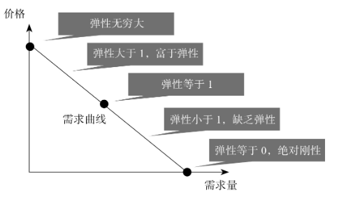

经济学中的规律，表面上看是关于人性的，实际上是关于生物普世的。需求定律是关于人性的定律，但它不仅适用于人，还适用于其他生物。只有掌握了这个规律，才算掌握了经济学思维的本质。

论述了 边际、需求第一&第二&第三定律、价格弹性、交易剩余、法律无效定律。

边际革命 : 不是越多越好

##### 第026讲 个人主义的主观价值论

###### 个人估值

一个人对一件商品的个人估值，是他为了得到这件商品所愿意支付的其他商品的最高数量。

- 个人的估值，不是集体的估值。
- 绝对主观的。
- 不以个人愿望为基础，而是以他所愿意放弃的其他商品的数量来计算。

客观价值论 VS 主观价值论

- 客观价值论能解释的现象，主观价值论也能解释。
- 客观价值论解释不了的现象，主观价值论也能解释。
- 主观价值论能更好指导生产。

##### 第027讲 边际革命

###### 边际 

就是“新增”带来的“新增”。要解释钻石和水给人带来的幸福谁大，必须用到“边际”概念。**边际效用递减**就是说，在单位时间内，随着人们消耗的某种商品的数量不断增加，消耗这种商品所能带来的新增享受迟早都会下降。

边际效用与边际成本趋同

第一个铜板买水比买钻石效用大，第一千零一个铜板用来买钻石比买水效用更大。我们总是把资源挪用到边际效用更高的用途上，直到所有资源的边际效用下降到相等为止。这个概念叫**边际平衡**。那么他的总效用就会达到最大。

需求定律 ：关于人性的定律

##### 第028讲 需求第一定律

当其他情况不变时，只要价格提高，商品的需求量就会减少；价格降到一定程度，需求量就会增加。

需求曲线：随着价格降低，需求量增加。

供应曲线：随着价格上升，供给量增加。

**消费者剩余**(交易剩余)：一个人对一件商品的个人估值，跟他为了得到这件商品所付出的代价之间的差距，我们称之为“剩余”。消费者剩余就是消费者的个人估值和他实际上支付的价格之间的差距。

##### 第029讲 需求第二定律

###### 定义

需求对价格的**弹性**，和价格变化之后流逝的时间长度成正比。也就是说，随着时间的推移，需求对价格的弹性会增加。

**需求的价格弹性**：需求的变化比例 / 价格的变化比例

任何商品都可以是奢侈品，也可以是必需品，这完全取决于价格的高低（比如在沙漠里水也能成为奢侈品）。

垂直的需求曲线不存在，因为人是会找到替代方案的。需求第二定律是说，随着时间的推移，需求对价格的弹性会逐渐增大。它的意思是，当出现新的情况、新的冲击时，人们寻找替代方案的范围一开始可能没那么大，但是随着时间的推移，他们选择替代方案的空间会越来越大，能够找到的对策就越来越多。（案例：突然下雨，出租车涨价3倍，任然不影响需求。但随着时间推移，我找到别的解决方案，比如搬到公司附近，需求弹性就会增加。）

房产交易税到底是买房人付的还是卖房人付的？正确的答案由两句话组成：税负是双方共同承担的；双方各付多少，取决于需求者和供应者双方的相对弹性，**谁的弹性低**，谁对这份交易的需求更迫切，**谁就付得多一点**。

而供需双方相对弹性的大小，跟法律与政府的规定本身没有关系。例如，不管法律或政府规定是雇主付养老保险还是雇员付养老保险，最后双方的分担都取决于雇主和雇员谁更需要这份工作。谁越需要这份工作，谁的谈判能力就越低，就会承担更大比例的负担。从长远看，法律规定没有效果，我们称这个规律为“**法律无效定****律**”（The Law of the Irrelevance of the Laws）。这个规律之所以起作用，背后的原因，就在于需求第二定律所刻画的基本人性，即人是会寻找对策的，而且时间越长，他们找到的对策就越多，法律规定带来的后果就越弱。

##### 第030讲 需求第三定律

每当消费者必须支付一笔附加费时，高品质的产品相对低品质的产品就变得便宜了，这笔附加费越高，高品质产品相对就越便宜。正因为这样，我们也把这个定律叫作“好东西运到远方去定律”。

附加成本上升，会导致供应品种变少。