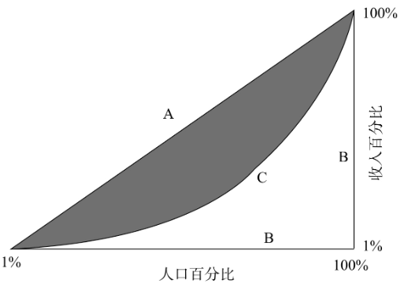
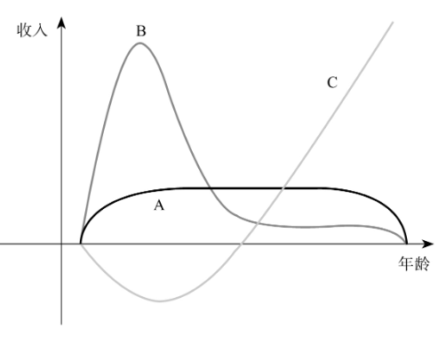

决策权：谁来当老板

##### 第091讲 企业团队的本质

解释一：企业存在是因为有交易费用。科斯1937年《企业的本质》，在企业可以大大缩减个人单独面对市场的“交易费用”。而交易费用又限制了企业的规模，企业越来越大就会造成管理成本过高。

解释二：企业存在是因为有团队效应。边际贡献决定单个成员在团队中的贡献率。

##### 第092讲 谁来当老板：资本和劳动力

资本与劳动力：谁是弱者谁当老板。资本和劳动力之间，资本往往是弱者，劳动力往往是强者。

企业管理的本质：防止劳动力滥用资本。

##### 第092讲 谁来当老板：专用资源和通用资源

第二个准则：企业里哪一种资源更容易被支配、被滥用，这种资源的所有者就应该成为指挥者。专用资源的所有者更在乎企业的成败。

专用资源必须在特定的平台上发挥作用。比如迈克尔杰克逊在舞台上有更大的决策权，而资本、灯光、以及其它团队要听他指挥。

##### 第093讲 谁来当老板：固定收入和剩余索取

用“剩余索取权”激励难以监督的合作者。一个产品卖了8元，先支付给阳光下的员工5元，剩余的支付给黑屋里的员工。

这些不同的机构、组织内部的治理关系，刻画、描述、解释这些组织内部的责权利关系。被统称为“制度经济学”。

#### 收入分配：政府是否应该劫富济贫

##### 第095讲 收入的高低和节奏由什么决定

一个员工在企业的议价能力取决于他在别处的机会。

边际贡献决定团队成员的收入水平。（肥猪丸使猪多长100斤，教授的收入就应该约等于100斤猪肉的收益）。

出租车司机的收入与份子钱的高低无关。

!工资是由市场的力量、市场的规律来决定的，而不是老板的慷慨或者贪狼决定的。

时薪月薪年薪：时间、空间的跨度越大，人的灵活度就越高。

唱歌比赛，第一名可以获得巨额报酬，第二第三名几乎什么都没有，这种工作的风险很大，根据结果来支付报酬，而不是前期投入。

明星一般不签终身合约，按片取报酬。教授一般把工资摊在一个很长的时间里。因为影片的质量很容易评估，而教授的工作品质很难评估。

产权保护决定收入节奏（以前师父和徒弟的关系，徒弟会被师父剥削一辈子。然后徒弟剥削他的徒弟）

##### 第096讲 事与愿违的同工同酬

哪里存在同工不同酬现象，哪里就存在廉价的优质员工。市场竞争的压力越大，雇主寻找廉价优质员工的积极性就越足，结果会使得同工不同酬的现象会趋于减少和消失。

岗位相同不等于工作相同。

同工同酬让弱者失去竞争武器。

##### 第097讲 事与愿违的最低工资法

最低工资法导致事业。（资本家投资机器、迁移厂房）

最低工资被用来提高竞争对手的成本。（南非最低工资法，让工作机会从黑人手里流到白人手里）。

最低工资剥夺穷人自立自强的机会。

##### 第098讲 基尼系数与收入分配

基尼系数图表

A和C的面积越小，收入就越平均。反之越不平均。

收入类型

不能以瞬间收入衡量收入差距

收入不平均和收入不公平是两回事：今天穷人与富人的差距，比以前大了。但这句话忽略一个事实，今天收入阶层之间的流动也比以前大了。

一个社会如果仅仅看见基尼系数上升、人与人之间收入的差距增大，就执行所谓的收入再分配政策，那就不仅不能准确地打击那些不公的行为，反而会使得那些造成合理收入差距的因素，受到不正确的抑制。

**脱贫致富：最富裕的穷人在今天**

##### 第099讲 工人违约是否应该成为权利

1902年阿拉斯加捕鱼案。渔民临时违约，临时签订的合约是否有效。英美习惯法里叫作“judgment proof”，即无执行力判决——不管法院怎么判，法院都拿被告没办法，反正他们就是赔不起。

“黄狗合约”（yellow–dog contract）工人签订不罢工的合约。

##### 第100讲 罢工的性质 

罢工和旷工是有区别的。罢工有两个特点：1 关键时候提出不干活，也叫敲竹竿。2 自己不干活的同时还阻止别人干活。

经济学家将工会看作是一种卡特尔，也就是垄断组织。

1935年《瓦格纳法》对罢工权利的确认。1947年《劳动权法》修正，非工会员工工人可以不参加罢工。

但罢工恰恰是反其道而行，它的本质就是集体违约，其结果是破坏了雇主和雇员之间的互信。罢工本来的目的是要帮助工人获得更高的收入，但是由于他们的做法违背了合作的原则，违背了“每一种生产要素应得的回报应该跟它的边际贡献相配”这样一个经济原则，所以长期而言，投资者就会以别的方式、在别的地方寻找替代方案。爱罢工的长远效果，就是连工作的机会都消失了。不难理解，越爱罢工的地方，生产力水平就越容易下降。

##### 第101讲  工作权利遇到障碍

1905年面包师加班案。联邦最高法院推翻纽约的劳动法，管的太宽，伤害了雇主和雇员之间自由签约的自由。其实纽约州这个法律对大的面包房没有影响，但是影响了小面包坊，提高了小面包坊的竞争力。

就业许可制度限制进入门槛。

##### 第102讲 最富裕的穷人在今天

穷人不能依赖社会福利，反而会削弱他们的生存能力。应该提高自身素质，终身学习。

穷人改善自己生活的另外一个办法，就是随着社会的进步参与分享，搭社会进步的顺风车。

科技创新使得社会上每一个人都能够得益，包括那些最贫困的人。