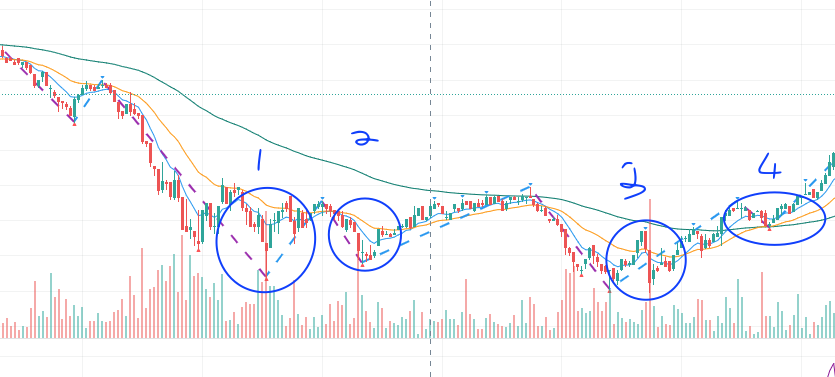

##### 关键位置放量

2020年2月11日AAPL的1M分型图

**位置 1**

1. 长下影 + 晨星 
2. 长影表示反击，且放大量。

**位置 2**

1. 一个大阴线，但没有跌破前低，且放巨量。表示有很多人在这个地方防守。位置2的大阴线和位置1的长影底分，价格位置差不多，还有更前面一个长上影（*表示多头向上反击，虽然没有成功*），都表达了一个意思，这里是非常关键的防守位置。

2. 大阴线后紧接着一个十字星，表示多空激烈交锋。
3. 缠论也可以认为这里是「二买」的位置。Re-Test 回测位置放大量，表示防守力量很大。

**位置3**

同样是一个二买回测的位置，放更巨量。表示防守意志非常强烈。

**位置4**

价柱站上所有的均线，宣誓多头正式回归。在拉升之前，市场做最后一次回测，同样一个大阴线，放大量。但是没有跌破均线。表示确认防守位置。

TSLA 2021年2月10日 1M 分型图

**位置1**

开盘第一根价柱，就是一个巨型十字，放超大量，多空在这里进行了极其猛烈的交战。随后的两根价柱宣誓空头获胜。特斯拉展开一轮壮烈的下跌趋势。

**位置2**

站上均线没有放大量，多头其实没有发出很强烈的信号。而随后的一根小阳线反而放出大量，这个位置的大量反而是力竭的意思。用了很大的力气想往上走，却走不动。

**位置3**

在90均线的阻力位置，两根大阳柱，同时放出大量。是希望能突破封锁，站上90均线的意愿。可惜随后的几根价柱表面，空头仍然稳稳的占据着防线。

**位置4**

站上均线的大阳线虽然很漂亮，但成交量没有特别大。多头虽然暂时占了上风，但没有向市场给出很强烈的信号。随后一根阴线伴随更大的成交量，表示空头再次夺回控制权。新一轮的打压已经不可避免了。

Facebook 2021年 2月11日 1M 分型图

比较位置1、2、3不同之处。 位置1是一笔向上后，顶分型出现阴线和放大量，这是空头夺权的意思。而2和3的位置分别是突破90均线后，市场回测均线放大量。这种大量往往是对支撑线的确认。虽然位置2又短暂回到均线以下。但位置3的再次确认，仍然展开一轮多头趋势。

位置4、5则是分别回到均线，而得到支撑的信号。